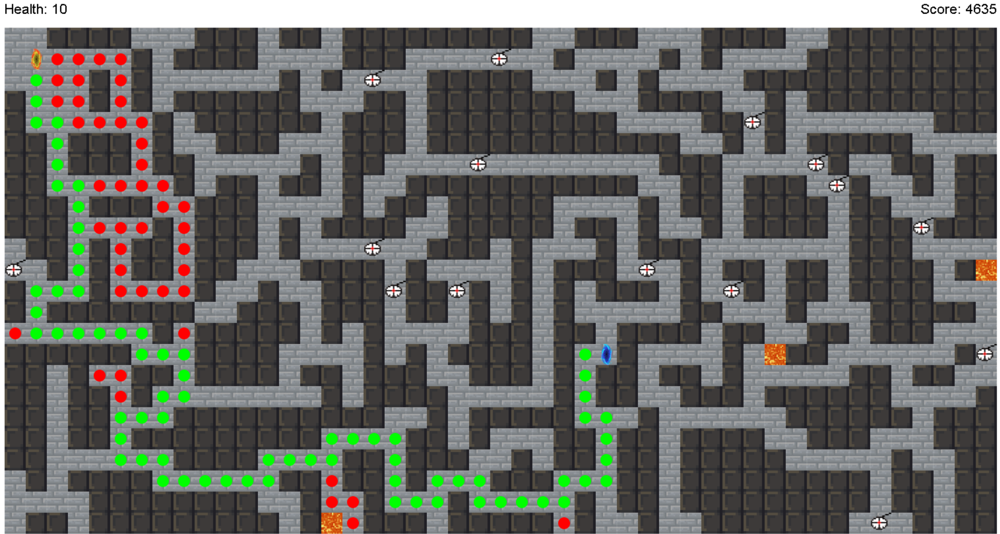

# Proyek alpro2_final1

## Peran:
- Fit: Gambaran Umum Projek
- Ivan: Map Generation
- Greg: Pathfinding
- Hansen: Visualisasi

## Gambaran Umum
main.py
```python
```



## Map Generation
- Ini create empty map dengan ukuran width dan height, jika map kosong/tidak dapat digunakan
```python
def createEmptyMap(width, height):
    return [[1] * width for _ in range(height)]
```

- Ini adalah fungsi untuk random map dengan membuat map yang berisi boolean, untuk mengecek apakah sudah di visit atau belum. Fungsi ini akan memulai pergerakan secara random dari koordinat x dan y yang diberikan sebagai parameter. Selanjutnya, fungsi ini akan mengacak urutan gerakan dari pilihan Kanan, Kiri, Atas, dan Bawah. Setelah itu, fungsi akan mengecek apakah tempat tersebut telah dikunjungi atau belum. Jika tempat tersebut belum dikunjungi, fungsi akan mengubah nilai tempat tersebut menjadi 0, menunjukkan bahwa tempat tersebut telah dikunjungi. Lalu, fungsi akan memeriksa dinding di sekitar tempat tersebut dan mengubah nilai dinding yang sesuai. Terakhir, fungsi akan mengembalikan map yang telah diacak:
```python
def randomMap(maze, x, y,visited=None):
    maze[y][x] = 0
    if visited == None:
        visited = [[False] * len(maze[0]) for _ in range(len(maze))]
    moves = [(0, 1), (1, 0), (0, -1), (-1, 0)]
    cover = [
        [(1, 0), (-1, 0)],
        [(0, 1), (0, -1)],
    ]
    random.shuffle(moves)
    for moveX, moveY in moves:
        next_moveX = x + moveX
        next_moveY = y + moveY
        if (next_moveX >= 0 and next_moveX < len(maze[0]) and next_moveY >= 0 and next_moveY < len(maze)):
            if maze[next_moveY][next_moveX] == 1 and not visited[next_moveY][next_moveX]:
                maze[y+moveY][x+moveX] = 0
                wall = []
                if(moveX,moveY) == moves[0]:
                    wall = cover[0]
                elif(moveX,moveY) == moves[1]:
                    wall = cover[1]
                elif(moveX,moveY) == moves[2]:
                    wall = cover[0]
                elif(moveX,moveY) == moves[3]:
                    wall = cover[1]
                wall1X,wall1Y = wall[0]
                wall2X,wall2Y = wall[1]
                if (next_moveX + wall1X >= 0 and next_moveX + wall1X < len(maze[0]) and next_moveY + wall1Y >= 0 and next_moveY + wall1Y < len(maze)):
                    visited[next_moveY + wall1Y][next_moveX + wall1X] = True
                if (next_moveX + wall2X >= 0 and next_moveX + wall2X < len(maze[0]) and next_moveY + wall2Y >= 0 and next_moveY + wall2Y < len(maze)):
                    visited[next_moveY + wall2Y][next_moveX + wall2X] = True
                randomMap(maze, next_moveX, next_moveY,visited)
    return maze
```

- Ini adalah fungsi untuk mengecek apakah bisa menaruh lava pada posisi x dan y dimana posisi x dan y adalah tembok dan juga memiliki jalan yang dapat dilewati lebih dari 2 atau bukan merupakan jalan buntu
```python
def validLava(maze, x, y):
    empty = 0
    if x-1 >= 0 and maze[y][x-1] == 0:
        empty += 1
    if x+1 < len(maze[0]) and maze[y][x+1] == 0:
        empty += 1
    if y-1 >= 0 and maze[y-1][x] == 0:
        empty += 1
    if y+1 < len(maze) and maze[y+1][x] == 0:
        empty += 1
    return (empty >= 2) and maze[y][x] == 1
```
## Pathfinding

## Visualisasi
